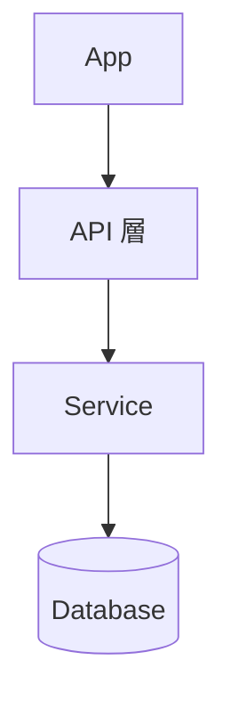

# Project Notes & Code Study (GitHub)

這是一個「把研究筆記與程式碼整理在同一個 GitHub 倉庫」的起手式模板。  
目標：**清楚的目錄架構 + 好維護的筆記 + 可公開的文件網站（可選）**。

## 結構
```
.
├─ README.md                # 專案總覽與索引
├─ CONTRIBUTING.md          # 撰寫筆記與 commit/PR 規範
├─ notes/                   # 你的研究筆記（原始、可雜亂）
│  ├─ 2025-09-16-log.md
│  └─ _template.md
├─ src/                     # 研究/實驗/閱讀用到的程式碼
│  └─ examples/
├─ docs/                    # 對外文件（GitHub Pages 用）
│  ├─ index.md
│  └─ notes/                # 精選或整理後的筆記副本
├─ scripts/                 # 小工具（如自動輸出目錄樹）
│  └─ tree.py
└─ .github/
   └─ ISSUE_TEMPLATE/
      └─ question.md        # 問題/待釐清 轉成 Issue 的樣板
```

## 快速開始
1. 新建 GitHub Repo（Private/ Public 皆可），把這個資料夾整包上傳或 `git push`。
2. 每次研究：
   - 在 `notes/` 用 `_template.md` 開一篇新筆記（或複製上一篇）。
   - 針對閱讀到的程式碼，在 `src/` 標清楚**目錄架構**與**註解**（見下）。
   - 若產生「問題/TODO」→ 用 **Issue** 追蹤（使用 `.github/ISSUE_TEMPLATE/question.md`）。
3. （可選）對外分享：把整理過的筆記放到 `docs/notes/`，用 MkDocs 產生網站。

## 產生目錄架構（程式碼樹）
安裝需求：Python 3。

```bash
python scripts/tree.py ./src > docs/code-tree.md
```

在 `README.md` 或 `docs/` 引用 `code-tree.md`，讓讀者一眼看懂目錄。

## MkDocs（可選，用於 GitHub Pages）
```bash
pip install mkdocs mkdocs-material
mkdocs serve           # 本地預覽 http://127.0.0.1:8000
mkdocs gh-deploy       # 會自動建立 gh-pages 分支
```
GitHub → Settings → Pages：選擇 **Deploy from a branch**，分支選 `gh-pages`。

## Mermaid 架構圖（示例）
在任一 Markdown 檔加入：



## 程式註解與文件撰寫建議
- **每個資料夾/模組**：在 `README.md` 或檔頭寫清楚用途與主要檔案。
- **每個檔案**：在檔首寫「這個檔案做什麼、主要函式/類別一覽」。  
- **函式/類別**：使用 docstring（Python）或 JSDoc（JS/TS）。例如：

**Python**
```python
def decode_prach(signal: np.ndarray, cfg: PreambleCfg) -> float:
    """估計 PRACH 到達時間 (ToA)。
    Args:
        signal: 時域收訊向量。
        cfg: 前同步碼設定。
    Returns:
        估計的 ToA（單位：樣點）。
    """
    ...
```

**TypeScript**
```ts
/**
 * 估計 PRACH 到達時間 (ToA)。
 * @param signal 時域收訊向量
 * @param cfg 前同步碼設定
 * @returns 估計的 ToA（樣點）
 */
export function estimateToA(signal: Float32Array, cfg: PreambleCfg): number Ellipsis
```

## Commit 與 PR 習慣
- **小步提交**、訊息清楚，建議採用 Conventional Commits：
  - `docs: add note for 2025-09-16`
  - `feat(src): add prach estimator`
  - `refactor(src): split utils`
- 用 **Pull Request** 整理：描述「做了什麼、為何、如何測」。

## 將「問題」變成追蹤項
- 在筆記中用 `Q:` 標示疑問，定期把它們開成 Issue。  
- 在程式碼用 `TODO:`、`FIXME:`，並在 PR 描述連結到對應 Issue（如 `#12`）。

---

> 小技巧：把 ChatGPT/Coding Agents 的輸出貼到 PR 讓隊友 review；或在 Issue 貼 prompt 與結論，讓過程可追溯。
