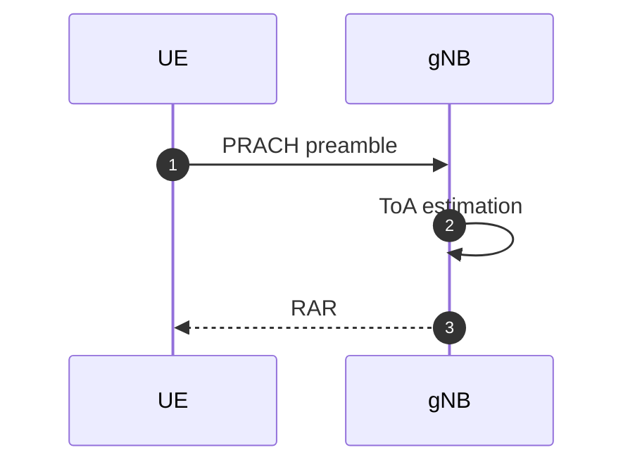

## 背景 / 目的
為什麼看這段/做這實驗？期待得到什麼？

## 重點筆記
- （條列）

## 代碼路徑
- 功能 → 對應檔案/函式：
  - <功能A> → `src/...`
  - <功能B> → `src/...`

## 架構 / 資料流（可用 Mermaid）

## 問題（Q）與假設（H）
- Q1: ...
- H1: ...（如何驗證？）

## 下一步
- [ ] ...
- [ ] ...
